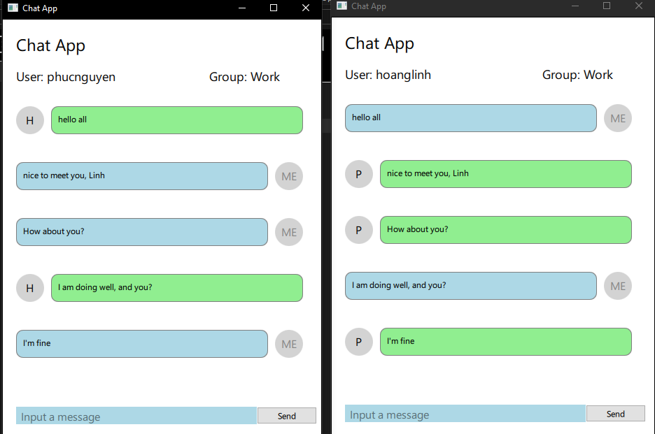
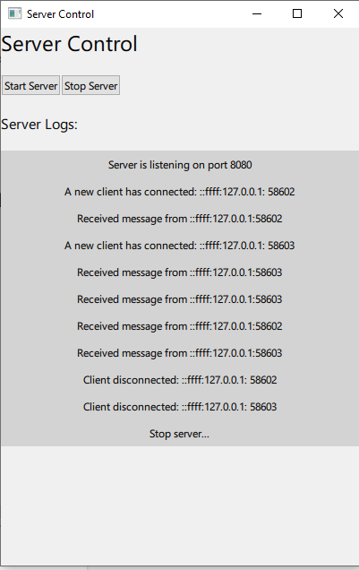
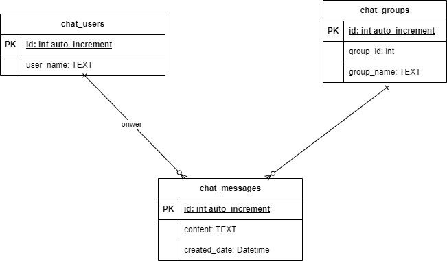

# **Qt Chat Application**

A simple chat application developed using C++ and Qt, supporting basic chat features such as group messaging and message history retrieval. This project demonstrates the use of TCP/IP for client-server communication and SQLite for message storage.
## **Application UI**
**Chat user interface** \


**Server control user interface** \


## **Key Features**
- **Group Chat**: Send and receive messages in chat groups.
- **Message History**: Retrieve past messages from a group.
- **Lightweight Communication**: Custom packet structure for efficient message exchange over TCP.

## **Technologies Used**
- **C++** (for business logic)
- **Qt Framework** (for UI and TCP communication)
- **SQLite** (for database storage)
- **TCP/IP Protocol** (for network communication)


## **Class Structure**

### **1. ChatClient**
Handles client-side operations such as sending and receiving messages, and retrieving message history from the server.

### **2. ChatServer**
Manages client connections, broadcasts messages to appropriate groups, and handles message storage.

### **3. ChatDatabaseManager**
Responsible for performing database operations (message storage and retrieval, user and group management).

### **4. MessagePacket**
Represents a packet used to send and receive data over TCP/IP. It encapsulates the message content, operation codes, and delimiters.

### **5. Message**
Represents an individual message with details like `id`, `ownerId`, `groupId`, `content`, and `createdDate`.

## **Packet Structure**

The communication between the client and server is handled using a simple packet structure:

### **Packet Format**
| Section           | Size          | Description                                                        |
|-------------------|---------------|--------------------------------------------------------------------|
| Start Section      | 2 bytes       | A fixed sequence `\n\r` indicating the start of a packet.           |
| Opcode             | 1 byte        | Represents the operation being performed (e.g., SEND, REQUEST).     |
| JSON Message       | Variable      | JSON-formatted string with the message or group data.               |
| End Section        | 2 bytes       | A fixed sequence `\r\n` marking the end of the packet.              |

### **Opcodes**
- `SEND (0x12)`: Send a message.
- `REQUEST_MESSAGES (0x13)`: Request past messages from a group.
- `GET_MESSAGES (0x14)`: Retrieve and send past messages.
- `REQUEST_GROUPS (0x15)`: Request a list of groups.
- `GET_GROUPS (0x16)`: Retrieve and send the list of groups.

### **Example Packet**
A packet to send a message:
```
\n\r 0x12 {"ownerId":1,"groupId":5,"content":"Hello!"} \r\n
```

## **Database Structure**
  
The application uses SQLite for message storage with tables for:
- **Users**: Stores user details.
- **Groups**: Stores group details.
- **Messages**: Stores message content with fields like `id`, `ownerId`, `groupId`, `content`, and `createdDate`.

## **Future Enhancements**
- **User Authentication**: Implement login functionality.
- **File Sharing**: Add support for file sharing in group chats.
- **Notifications**: Implement real-time notifications for new messages.
